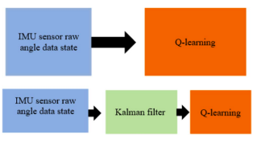
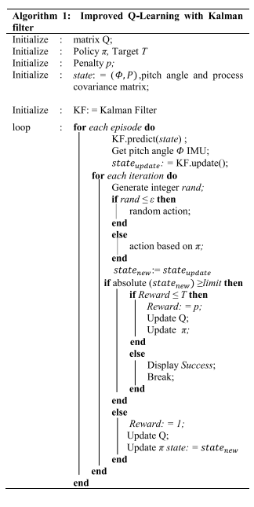
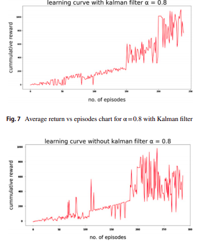
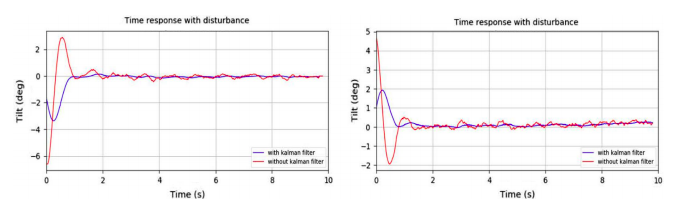
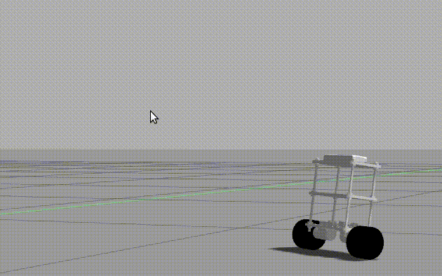
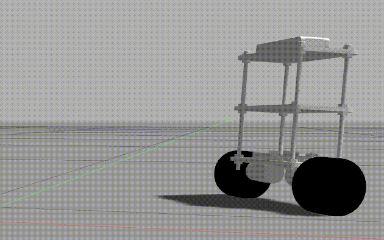

## An Improved Q-learning approach with kalman filter for Self-Balancing Robot

Novel Approach The work includes extension of
Q-learning algorithm (Rahman et al., 2018) in self-balancing robot problem with the introduction of the Kalman-flter for better estimation of pitch angle from IMU, and this estimate is passed to Q-learning for robot balancing. Raw angle data is generally passed as a state to Q-learning,
but it contains erroneous data. To get improved performance and training, a better estimate of pitch angle or in ideal case, errorless angle data is required to train faster
and achieve maximum reward, but due to external uncertainties, there is always some residual error. 

These issues can be compensated with applying various filters and
control methods such as LQR, PID and ADRC. In this implementation, we choose Kalman flter (Fig. 1). Instead of passing raw angle data from robot sensors as a state to
Q-learning algorithm, the introduction of Kalman flter before passing the raw angle data will predict and update the pitch angle. Therefore, the output angle data with a
better estimate of raw angle from Kalman flter is passed to
Q-learning algorithm. After training the Q-learning with raw angle data and with Kalman flter output angle data, result is compared based on number of episodes required
to train as well as rewards collected. Higher reward and lesser number of episodes to get trained imply that the model is performing better.

### Robot time response at 2 units impulse response (with and without kalman-filter while training using Q-learning).

`Robot recovery response slower when angular output passed directly for Q-learning`

`Robot recovery response faster when angular output passed through Kalman-filter for Q-learning` 

It was found that Q-learning model trained with Kalman flter had better
time response when external disturbance was applied compared to without Kalman flter. This approach of cascading two well-tested techniques

Refer - 
 

